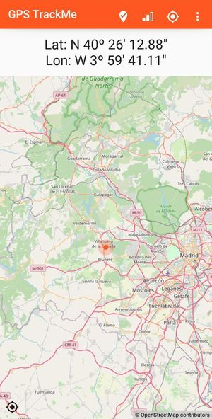
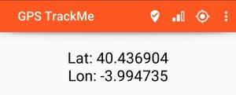

# GPS TrackMe

This is a simple mobile application to register your gps position at a given moment in time.

The initial idea behind the application is to be able to get the GPS coordinates of your position, at a given time, so you can later know your position exactly. It can be used to know the GPS coordinates when taking a picture (if using a camera without GPS, or with GPS switched off), or to be able to remember a certain location.

## Installation

Install it from the .apk application you can find in [github repository](https://github.com/osso73/gps_trackme/tree/main/releasess).

You can also build it from the source code you will find on the same folder.

## Using the app

The usage is very straight forward: when you open the app, you have a screen like this:

_**Fig. 1**: Main screen._

When launched, the application will immediately start looking for GPS signal, entering into *searching* mode. The first time it will request the permissions. 

Once the position is found, you will see the coordinates in the label part. In later versions there will be a map in the lower part of the screen, to show your position on the map.

The title bar includes some icons that allow you several actions:

- location track: (feature not yet implemented) this icon will track your current location. Location is tracked on a log file, with the date and time. Later this log file can seen, with all the track points. Note this is not a GPX file, as it will track when you click on the icon.

- signal icon: this shows the level of accuracy of the signal. No action when clicked.

- gps icon: to turn GPS on and off. It shows as well the status of GPS, which can be off, searching, or on. Searching meaning that the GPS is turned on, but has not yet received any valid signal.

- menu icon: (feature not yet implemented) this will open a menu with several options, to access settings, help (e.g. these instructions) and information about the version, etc.

You can change the format of the display by clicking on the label. This switches format of coordinates between "degrees, minutes and seconds", and "decimal degrees" (see example in _Fig. 2_)

_**Fig. 2**: Coordinates in decimal degrees format._
