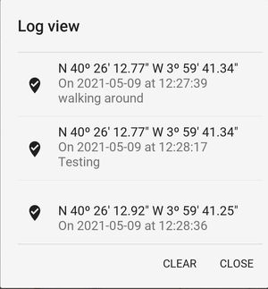

# GPS TrackMe

This is a simple mobile application to register your gps position at a given moment in time. These are the instructions for *version 1.0*.

The initial idea behind the application is to be able to get the GPS coordinates of your position, at a given time, so you can later know your position exactly. It can be used to know the GPS coordinates when taking a picture (if using a camera without GPS, or with GPS switched off), or to be able to remember a certain location.

## Installation

Install it from the .apk application you can find in [github repository](https://github.com/osso73/gps_trackme/tree/main/releases).

You can also build it from the source code you will find on the same repository.

## Using the app

The usage is very straight forward: when you open the app, you have a screen like this:

_**Fig. 1**: Main screen._

### Toolbar and buttons

When launched, the application will immediately start looking for GPS signal, entering into *searching* mode. The first time it will request the permissions.

Once the position is found, you will see the coordinates in the label part, and your position is shown on the map with a blinking marker.

The title bar includes some icons that allow you several actions:

- ![][track] - this icon tracks your current location. Click on the button to capture the coordinates as they are shown on the screen, along with the timestamp and you can also add a comment. This information is kept in a log, that you can check later from the menu to see the positions that have been captured. Note this is not a GPX file, it will track only one point at a time, and the file is not using GPX format.

- ![][accuracy] - this shows the level of accuracy of the signal provided by the GPS of the phone. No action when clicked.

- ![][gps] - to turn GPS on and off. It shows as well the status of GPS, which can be off, searching, or on. Searching meaning that the GPS is turned on, but has not yet received any valid signal. Note this is only switching off the updates on the application, but does not really switch off the GPS on your phone.

- ![][menu] - this opens a menu with several options: see the log, to access settings, help (e.g. these instructions) and information about the version, etc. See [below](#menu) for a more detailed explanation on each of these options.

### Label with coordinates

The GPS coordinates can be shown in decimal degrees, or in degrees/minutes/seconds format, as shown in the Fig. 2. To change format just click on the label.

_**Fig. 2**: Coordinates in decimal degrees format._

### Map section

The application shows your position on a map with a blinking marker. The marker will keep blinking if the GPS is active; otherwise it will stop blinking.

By default, the map is centered on your position, but you can de-activate the automatic centering by clicking the gps button (![icon_gps]) on the map, at the bottom left corner, so you can move around and see other areas of the map. Clicking again will activate the automatic centering.

### Menu

The menu has several options:

- **See log**: this will show the log of the points that have been tracked, along with the date and time, and a comment if this was provided. An example is provided in Fig. 3. From this view, you can clear the log by clicking on the _CLEAR_ button, this will remove all entries.

    

    _**Fig. 3**: Example of log shown, with the positions, timestamps and comments._

    For now, you cannot share the log information with other applications, this feature may be added later in future versions.

- **Help**: will open a browser with these instructions here.

- **Settings**: will open the settings window. This is not yet implemented, for now it shows only the kivy settings. But will have some settings in later versions.

- **About**: will display information about the version, author, and github link.

[gps]: ./img/icon_gps.png "gps icon"
[accuracy]: ./img/icon_accuracy.png "accuracy icon"
[track]: ./img/icon_track.png "track icon"
[menu]: ./img/icon_menu.png "menu icon"
